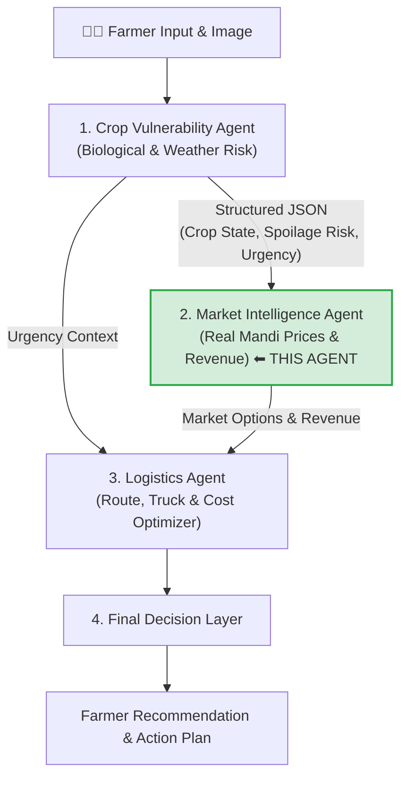
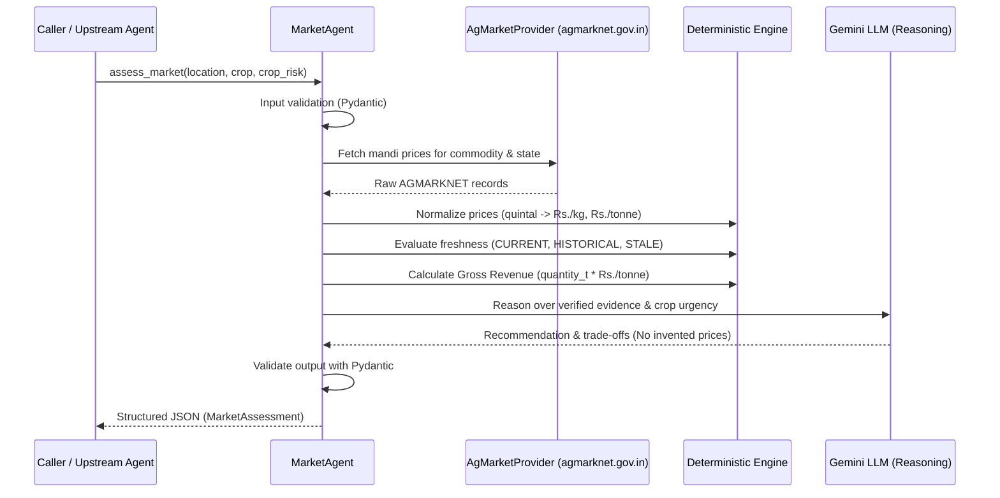

# KISAN GUARD — Market Intelligence Agent 🌾📈

**Developer Integration Guide, Architecture & API Contract**

The **Market Intelligence Agent** is the market intelligence layer of **KISAN GUARD**. It answers the core question:
> *"Given the farmer's crop, quantity, location, crop state, crop vulnerability, spoilage risk, urgency, and verified market data — which market/mandi opportunities appear most favorable?"*

---

## 🧭 Multi-Agent System Role & Boundaries



### Strict Agent Boundaries:

| Component | Responsibility (OWNS) | Must NOT Do |
|---|---|---|
| **Crop Vulnerability Agent** | Crop health, leaf analysis, weather forecast, biological vulnerability, harvest urgency | Mandi selection, price comparison, route planning |
| **Market Intelligence Agent (This)** | Mandi price retrieval, unit normalization (Rs./kg), freshness verification, gross revenue, LLM trade-off analysis | Image analysis, disease diagnosis, route distance/transport cost optimization |
| **Logistics Agent** | Road distance, vehicle capacities, travel times, transport costs, net profit optimization | Medical diagnosis, fetching mandi prices |

---

## ⚡ Quickstart for Teammates (30 Seconds)

### 1. Installation
From the root or `market/` directory:
```bash
# Using pip or uv
pip install -r market/requirements.txt
```

### 2. Configure Environment
Copy `.env.example` to `.env` in `market/` or project root:
```bash
# Required for Gemini LLM reasoning (same key used by Crop Agent):
GEMINI_API_KEY=your_gemini_api_key_here
```

### 3. Run in Python
```python
from market.market_agent import MarketAgent

agent = MarketAgent()

# Pass crop details + (optional) upstream Crop Agent output:
result_json = agent.assess_market(
    location={"latitude": 28.4744, "longitude": 77.5040},
    crop={"name": "tomato", "variety": "hybrid", "quantity_t": 3.0},
    crop_risk={
        "crop_state": "HARVEST_READY",
        "risk": {
            "vulnerability_score": 0.78,
            "risk_level": "HIGH",
            "spoilage_risk": 0.85,
            "harvest_urgency": 0.90,
            "recommended_action_window_hours": 12,
            "recommended_urgency": "URGENT_MOVEMENT"
        },
        "confidence": 0.91,
        "evidence_consistency": "CONSISTENT"
    }
)
print(result_json)
```

---

## 🚀 Running the FastAPI REST Server

You can run the standalone FastAPI server for interactive testing or frontend consumption:

```bash
uvicorn market.api:app --host 0.0.0.0 --port 8001 --reload
```

- **Interactive Swagger Docs UI**: [http://localhost:8001/docs](http://localhost:8001/docs)
- **API Base URL**: `http://localhost:8001`

### Endpoints:
- `POST /market/assess` — Runs complete market assessment (JSON body matching input schema).
- `GET /market/commodities` — Returns array of all supported commodities.
- `GET /market/health` — Health check endpoint.

---

## 📦 Directory Structure

```text
market/
├── market_agent.py          # Core Market Agent logic (stateless, zero DB)
├── api.py                   # FastAPI application & APIRouter (/market/*)
├── test_market_agent.py     # Automated test suite (35 tests covering all cases)
├── requirements.txt         # Dependencies
├── .env.example             # Environment template
├── __init__.py              # Clean package exports (MarketAgent, market_router, market_app)
└── MARKET_AGENT.md          # This documentation
```

---

## 🔬 How the Evidence Pipeline Works



---

## 📋 Input Contract

### Parameters for `assess_market(...)`:

#### 1. `location` (dict, required)
```json
{
  "latitude": 28.4744,
  "longitude": 77.5040
}
```

#### 2. `crop` (dict, required)
```json
{
  "name": "tomato",
  "variety": "hybrid",
  "quantity_t": 3.0
}
```
*Note: `quantity_t` is in metric tonnes. If omitted, gross revenue will be `null` while price comparison still works.*

#### 3. `crop_risk` (dict, optional)
Directly pass the dictionary returned by the `CropVulnerabilityAgent`:
```json
{
  "crop_state": "HARVEST_READY",
  "risk": {
    "vulnerability_score": 0.78,
    "risk_level": "HIGH",
    "spoilage_risk": 0.85,
    "harvest_urgency": 0.90,
    "recommended_action_window_hours": 12,
    "recommended_urgency": "URGENT_MOVEMENT"
  },
  "confidence": 0.91,
  "evidence_consistency": "CONSISTENT"
}
```
*If omitted or `None`, the Market Agent operates in standalone mode with reduced confidence and flags the missing context in `uncertainties`.*

---

## 📊 Output Contract (`MarketAssessment`)

The agent returns a Pydantic-validated JSON string:

```json
{
  "crop": "tomato",
  "quantity_t": 3.0,
  "market_options": [
    {
      "market_name": "Azadpur Mandi (Delhi)",
      "state": "Delhi",
      "district": "North Delhi",
      "commodity": "Tomato",
      "variety": "Hybrid",
      "min_price": 2800.0,
      "max_price": 3600.0,
      "modal_price": 3200.0,
      "original_unit": "quintal",
      "normalized_price_per_kg": 32.0,
      "normalized_price_per_tonne": 32000.0,
      "arrival_date": "20/08/2026",
      "freshness": "CURRENT",
      "source": "agmarknet.gov.in",
      "retrieval_timestamp": "2026-08-20T18:08:29.726049+00:00"
    },
    {
      "market_name": "Gurugram Mandi",
      "state": "Haryana",
      "district": "Gurugram",
      "commodity": "Tomato",
      "variety": "Hybrid",
      "min_price": 2600.0,
      "max_price": 3200.0,
      "modal_price": 2900.0,
      "original_unit": "quintal",
      "normalized_price_per_kg": 29.0,
      "normalized_price_per_tonne": 29000.0,
      "arrival_date": "20/08/2026",
      "freshness": "CURRENT",
      "source": "agmarknet.gov.in",
      "retrieval_timestamp": "2026-08-20T18:08:29.726049+00:00"
    }
  ],
  "recommended_market": "Azadpur Mandi (Delhi)",
  "expected_gross_revenue": 96000.0,
  "recommendation": "Azadpur Mandi (Delhi) offers the highest verified modal price of Rs. 32/kg. Given high spoilage risk (85%) and a short 12-hour action window, immediate dispatch to a high-liquidity mandi is strongly advised.",
  "confidence": 0.91,
  "urgency_context": "URGENT: Crop requires immediate market movement. Spoilage risk is 85% with only 12 hours action window. Prioritize markets with fresh, verified data.",
  "uncertainties": [
    "Market distance is estimated by geographic proximity, not actual road distance. Actual transport feasibility belongs to the Logistics Agent."
  ],
  "data_quality": {
    "provider": "AgMarket-API (agmarknet.gov.in)",
    "provider_status": "AVAILABLE",
    "total_records_fetched": 3,
    "valid_records": 3,
    "stale_records": 0,
    "data_age_description": "3 current"
  },
  "evidence": {
    "provider": "AgMarket-API (agmarknet.gov.in)",
    "api_url_used": "https://agmarknet.gov.in/...",
    "retrieved_at": "2026-08-20T18:08:29.726049+00:00",
    "raw_record_count": 3,
    "records": [...]
  },
  "status": "SUCCESS",
  "generated_at": "2026-08-20T18:08:29.871170+00:00"
}
```

---

## 🔗 Multi-Agent Integration Examples

### Example 1: End-to-End Pipeline with Person 1 (Crop Vulnerability Agent)

```python
import json
from crop_vulnerability_agent import CropVulnerabilityAgent
from market import MarketAgent

# 1. Person 1: Assess biological/weather vulnerability
crop_agent = CropVulnerabilityAgent()
crop_json = crop_agent.assess_vulnerability(
    location={"latitude": 28.4744, "longitude": 77.5040},
    crop={"name": "tomato", "stage": "fruiting", "quantity_t": 3.0, "harvest_status": "READY"},
    farmer_observation={"text": "Tomatoes are ready, heavy clouds approaching", "storage_condition": "unknown"}
)
crop_result = json.loads(crop_json)

# 2. Person 2 (This Agent): Assess market with crop risk context
market_agent = MarketAgent()
market_json = market_agent.assess_market(
    location={"latitude": 28.4744, "longitude": 77.5040},
    crop={"name": "tomato", "variety": "hybrid", "quantity_t": 3.0},
    crop_risk=crop_result
)
market_result = json.loads(market_json)

print(f"Recommended Market: {market_result['recommended_market']}")
print(f"Gross Realization: Rs. {market_result['expected_gross_revenue']:,.2f}")
```

### Example 2: Consumption by Person 3 (Logistics / Optimization Agent)

The Logistics Agent consumes the output of this agent to calculate net revenue:

$$\text{Net Profit} = \text{expected\_gross\_revenue} - \text{Transport Cost} - \text{Handling/Storage Costs}$$

```python
# Downstream Logistics Agent accesses:
candidate_mandis = market_result["market_options"]
urgency_window = market_result["urgency_context"]

for mandi in candidate_mandis:
    mandi_name = mandi["market_name"]
    price_per_kg = mandi["normalized_price_per_kg"]
    # Run route optimization and vehicle allocation...
```

---

## 🧪 Automated Testing & Verification

The test suite runs **35 automated test cases** without requiring external internet access (using deterministic mocked responses):

```bash
pytest market/test_market_agent.py -v
```

### Tested Scenarios:
1. **Price Normalization** (`₹/quintal` → `₹/kg`, `₹/tonne`, rejection of invalid units like `bag`)
2. **Freshness Classification** (`CURRENT` $\le$ 1 day, `HISTORICAL` $\le$ 3 days, `STALE` $\le$ 7 days)
3. **Revenue Calculation** (Deterministic arithmetic, never hallucinated)
4. **High/Low Spoilage Influence** (Urgency context changes dynamically based on Crop Agent)
5. **Missing/Stale Prices Handling** (Gracefully skipped, never fabricated)
6. **API Failures** (Structured `API_FAILURE` response without crashing)
7. **FastAPI Endpoints** (`POST /market/assess`, `GET /market/commodities`, `GET /market/health`, 422 validations)

---

## 🛡️ Failure & Edge Case Handling

| Scenario | Agent Behavior |
|---|---|
| **API Down / Network Failure** | Returns `status="API_FAILURE"`, 0 fabricated records, clear error explanation. |
| **Unsupported Crop** | Returns `status="UNSUPPORTED_CROP"` listing all supported crops. |
| **Missing Quantity** | Evaluates and ranks prices normally; sets `expected_gross_revenue=null`. |
| **Missing Crop Risk Context** | Evaluates prices; lowers confidence score by 0.1 and flags missing context in `uncertainties`. |
| **Conflicting Crop Evidence** | Upstream `evidence_consistency="CONFLICTING"` reduces confidence and triggers cautionary trade-off analysis. |
| **Gemini API Unavailable** | Gracefully falls back to deterministic rule-based recommendation without failing. |
| **LangSmith Unavailable** | Tracing safely degrades to no-op without impacting performance. |
